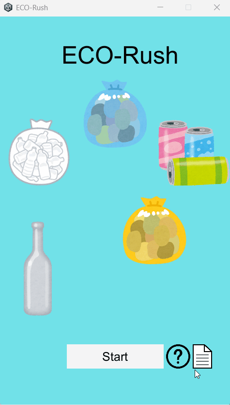

# ECO-Rush

## 🚀 キャプチャ / デモ



## 概要

UnityとC#で制作した、30秒間のタイムアタック型「ゴミ分別ゲーム」です。次々と表示されるゴミ（燃える、燃えない、ビン、カン、ペットボトル）を、制限時間内にどれだけ正確に、素早く分別できるかに挑戦します。コンボシステムとハイスコア機能を搭載しています。
本作は、作者が高校時代に初めてゼロから開発したゲームであり、現在はコードの改良に努めています。

## 🛠️ 使用技術

-   **Game Engine:** Unity (6000.0.44f1)    
-   **Language:** C#    
-   **IDE:** Visual Studio 2022

## ✨ 機能一覧

-   タイトル・ゲーム・リザルト画面間のシーン遷移
-   3秒の開始カウントダウンと30秒のゲーム内タイマー
-   5種類のゴミ（燃える、燃えない、ビン、カン、ペット）の動的生成
-   分別（正解・不正解）判定に基づくスコアとコンボの計算
-   `PlayerPrefs` を利用した永続的なハイスコア保存・表示
-   最終スコアに応じた4段階の評価サウンド再生

## 📦 インストール / セットアップ

▼ 実行ファイル（Windows）（準備中）
1.  GitHubリポジトリの「Releases」ページから最新の `.zip` ファイルをダウンロードします。
2.  zipを解凍し、`ECO-Rush.exe` を実行してください。

▼ プロジェクトから実行
```bash
# 1. リポジトリをクローン
git clone https://github.com/Dai-j23/ECO_Rush.git
# 2. Unity Hub からプロジェクトを開く
# (Unity Editor 6000.0.44f1 推奨)
```

## 📜 ライセンス

This project is licensed under the MIT License.

## 💡 工夫した点 / 苦労した点

### 厳密なゲームシーケンス制御：
最も工夫した点は、Main.cs の Update メソッド内での厳密なシーケンス制御です。複数の状態フラグを管理し、「① 開始カウントダウン」→「② ゲーム本編（制限時間処理とゴミ生成）」→「③ 時間切れによるリザルト遷移」という一連の流れを、フラグの状態に応じて厳密に制御しました。
### コアゲームサイクルの実装：
ゲームのコアサイクルとして、(1) ゴミのオブジェクトを Instantiate で動的に生成 → (2) プレイヤーのUIボタン入力をトリガーに正誤を判定 → (3) Destroy で対象オブジェクトを破棄する、というライフサイクルを実装しました。これにより、「オブジェクトが状態を持ち、Update で更新し、イベントで相互作用する」というUnityの設計思想を、実装を通じて深く理解できました。
### ゲーム性を高める演出：
単純なスコア加算だけでなく、連続正解でスコアが伸びる「コンボ」システムを導入。リザルト画面では、最終スコアに応じて再生されるサウンドを4段階に分岐させ、プレイヤーの達成感を刺激する演出を加えています。

## 🧭 今後の改善方針

* **1. 不明瞭な変数名の変更**
意図が即座にわからない変数名を、その役割が明確にわかる名前に変更する。
* **2. 変数名の統一**
日本語ローマ字の変数名と英語の変数名が混在しているため、英語に統一する。
* **3. 冗長なロジックの統合 (DRY原則)**
`Main.cs` にある5つのゴミ分別ボタンの処理（`OnClickmoeruButton` など）は、中身のロジックがほぼ同一であるため、引数を受け取る単一のメソッドに統合し、コードの重複を排除する。
* **4. 状態管理の再設計**
`Main.cs` の `Update` 関数内で行っている、整数フラグによる複雑な状態管理を、`enum`（列挙型）を用いたステートマシンに置き換える。これにより、`Update` 内の処理が `switch` 文などで明確に分離され、可読性と拡張性が向上する。

## 🧩 クレジット (Special Thanks)

本作の開発にあたり、以下の素晴らしい素材を利用させていただきました。（※各サイトの利用規約に基づき、再配布に当たるとして素材ファイル自体はリポジトリより削除しました。）
  * **画像素材：**
      * [かわいいフリー素材集 いらすとや](https://www.irasutoya.com/)
      * [ICOOON MONO](https://icooon-mono.com/)
  * **サウンド素材：**
      * [効果音ラボ](https://soundeffect-lab.info/)
      * [zukisuzuki BGM](https://zukisuzukibgm.com/)
